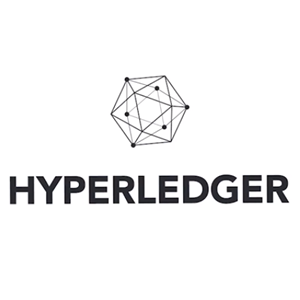

## Go语言简介、历史背景、发展现状及语言特性

### 一、谷歌软件开发面临的挑战

1. 多核硬件架构

2. 超大规模分布式计算集群

3. Web模式导致的前所未有的开发规模和更新速度

### 二、Go的创始人（大师作）

1. Rob Pike（罗布·派克）

   

   Unix的早期开发者、UTF-8的创始人，现在谷歌操作做操作研究。

2. Ken Thompson（肯·汤普森）

   

   肯·汤普森（Kenneth Lane Thompson），一般称之为Ken Thompson，为美国计算机科学学者，与丹尼斯·里奇同为1983年图灵奖得主。Uinx的创始人、C语言的创始人。

3. Robert Griesemer（罗伯特·格瑞史莫）

   

   谷歌大名鼎鼎的V8引擎、JVM Hot Spot的开发者

### 三、Go的特性

1. 简单

   C的关键字37个

   C++的关键字84个

   Go的关键字25个

2. 高效

   编译的强类型语言

3. 生产力

   语言简洁

   编程约束给开发者最好的选择

### 四、优秀应用

#### 云计算开发语言

#### 区块链开发语言

### 五、Go下载与安装

1. 下载

   https://golang.google.cn/ （官方网站）

2. 安装

   比较简单，下一步就可以

   新版本环境GOPATH变量可配，也可以不配

3. 开发工具

   Idea、GoLand、Vscode 等都可以
